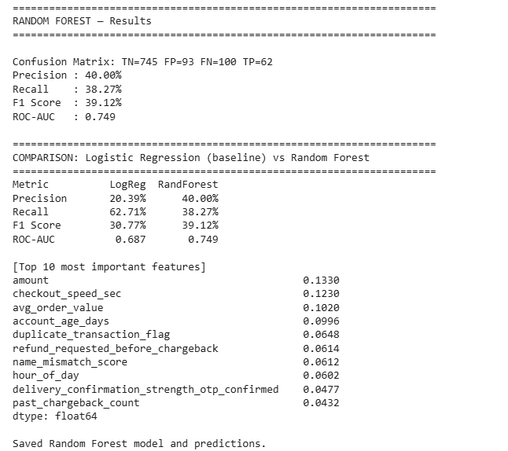
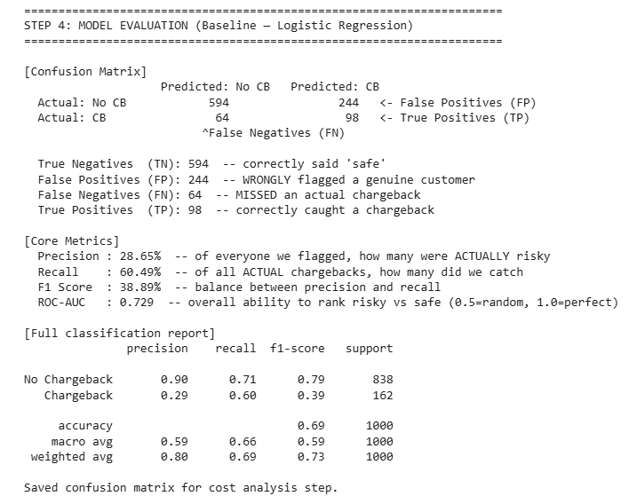
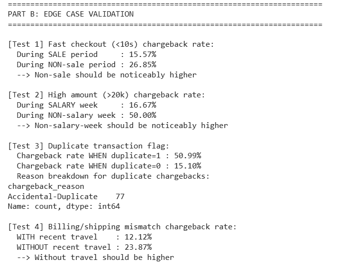
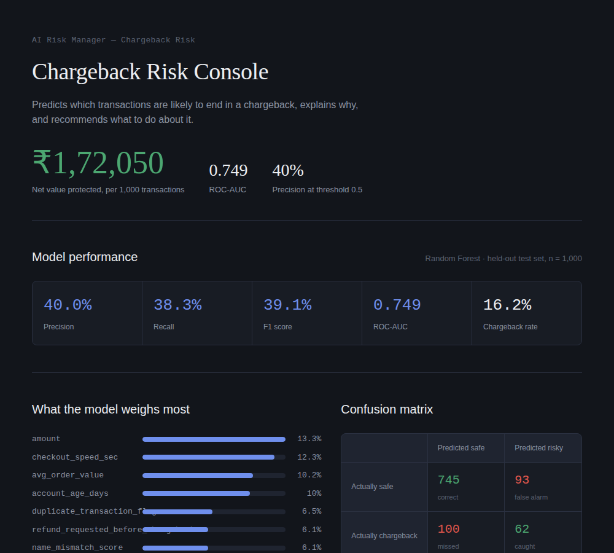
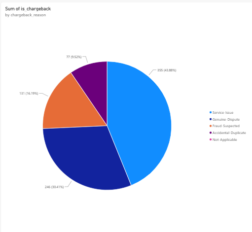
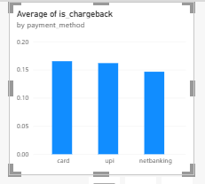
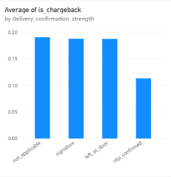
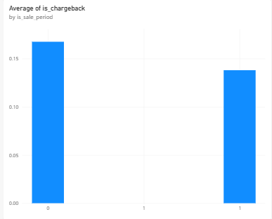
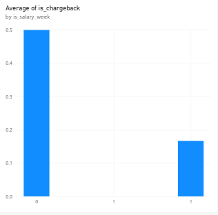

# Chargeback Risk Predictor

An AI-based risk detector that predicts whether a transaction is likely to result in a chargeback, explains why, and recommends an appropriate action.

Built for the **AI Risk Manager** track — one class of loss (chargebacks), a working detector with measured precision and recall on a held-out test set, and honest reporting of false-positive cost.

**Built for Razorpay's AI Risk Manager challenge**, focusing on chargeback risk detection for online payment transactions.

**Live dashboard:** [kritig-09.github.io/chargeback-risk-predictor](https://kritig-09.github.io/chargeback-risk-predictor/dashboard.html)

---

## Table of Contents

- [Problem](#problem)
- [Approach](#approach)
- [Features Used](#features-used)
- [Results](#results)
- [Cost Impact](#cost-impact)
- [Dashboard](#dashboard)
- [Visual Analysis (Power BI)](#visual-analysis-power-bi)
- [Limitations](#limitations)
- [Project Report](#project-report)
- [Repository Structure](#repository-structure)
- [How to Run](#how-to-run)

---

## Problem

Merchants accepting online payments lose money to fraud, returns, and chargebacks. A chargeback occurs when a customer disputes a transaction with their bank, forcing a refund — often with an additional penalty to the merchant. Left undetected, a high chargeback rate can also get a merchant's payment account flagged or suspended.

Chargebacks were chosen as the specific loss type to target, over fraud or return abuse, because the risk signals involved (transaction amount, address mismatch, account age, delivery evidence) are relatively objective — and the problem naturally extends into an explainable, actionable system rather than a plain yes/no classifier. (Full reasoning: [Project Report](Project_Report.pdf).)

## Approach

```
Synthetic data generation (business-rule based)
        │
        ▼
Exploratory analysis + edge-case validation
        │
        ▼
Model training — Logistic Regression → Random Forest
        │
        ▼
Threshold tuning
        │
        ▼
Cost-impact analysis (₹ value)
        │
        ▼
Edge-case scenario testing
        │
        ▼
Reason-classification layer (why + suggested action)
        │
        ▼
Interactive dashboard
```

Real chargeback-labelled datasets are not publicly available, and public fraud datasets that do exist use anonymised, unlabelled columns that rule out building the business-context features this project relies on. A synthetic dataset was generated instead, from explicit, documented business rules, with random noise added so it isn't perfectly separable.

## Features Used

20 features across six categories:

| Category | Features |
|---|---|
| Core transaction | amount, hour of day, payment method |
| Customer history | account age, average order value, past chargeback count |
| Mismatch signals | billing/shipping mismatch, name mismatch score, device-sharing flag |
| Velocity | transactions in last 24h, failed attempts, checkout speed |
| Verification/evidence | secondary (OTP) verification, delivery confirmation strength, refund-requested-before-chargeback, duplicate-transaction flag |
| **Context flags** | sale-period, salary-week, high-value category (medical/travel), recent location change |

The context flags are the core idea of this project: they prevent a naive model from flagging normal consumer behaviour as fraud — e.g. a large purchase right after payday, a fast checkout during a flash sale, or an address mismatch caused by genuine travel.

## Results

Final model: **Random Forest**, threshold = 0.5

| Metric | Value |
|---|---|
| Precision | 40.0% |
| Recall | 38.3% |
| F1 Score | 39.1% |
| ROC-AUC | 0.749 |
| Chargeback rate (test set) | 16.2% |

**Data split:** 80% training (4,000 transactions) / 20% held-out test (1,000 transactions).

Random Forest was chosen over Logistic Regression (higher recall but much lower precision, 20–29%) because minimising false positives — avoiding friction for genuine customers — was treated as the higher priority for a payment platform.

<p float="left">
  
  
</p>

**Context-awareness was explicitly validated** — the same raw signal produces a different risk level depending on circumstance:



## Cost Impact

Confusion-matrix outcomes were converted into an illustrative ₹ estimate (assumed: ₹3,000 average order value, ₹150 friction cost per false positive — both estimates, not real merchant figures):

| Item | Amount |
|---|---|
| Value from 62 chargebacks caught early | + ₹1,86,000 |
| Cost of 93 false positives (review friction) | − ₹13,950 |
| **Illustrative net value on 1,000 test transactions** | **₹1,72,050** |

The 100 still-missed chargebacks (₹3,00,000) are not counted as a model cost — that loss occurs with or without any detection system, and represents room for future improvement.

## Dashboard

A standalone, self-contained interactive dashboard — **[view it live](https://kritig-09.github.io/chargeback-risk-predictor/dashboard.html)**, or open `dashboard.html` directly in any browser (no server required).



It includes headline business impact, model metrics, feature importance, a confusion matrix, a **live "Try a Transaction"** explorer with 9 curated scenarios (real model predictions, not simulated), a chargeback-reason breakdown, and the context-awareness comparisons above.

### Custom Transaction Predictor

Beyond the 9 curated scenarios, the dashboard also lets you enter your own transaction — all 20 raw features, including payment method, delivery confirmation, and context flags — and get a live risk prediction. This runs the actual trained Random Forest (200 trees), exported to JS and executed entirely client-side, not an approximation. Flagged transactions get the same reason and suggested-action logic as `reason_classifier.py`.

For the interactive demo, risk is also presented as operational guidance: **Low risk → Approve, Medium risk → Review, High risk → Verify/Block.** These bands are presentation-only; the model's binary flag threshold remains 50%.

## Visual Analysis (Power BI)

Supplementary charts built directly from the generated dataset:

<p float="left">
  
  
  
</p>
<p float="left">
  
  
</p>

Findings:
- Chargebacks are **not primarily a fraud problem** — Service-Issue (43.9%) and Genuine-Dispute (30.4%) together account for nearly three-quarters of cases.
- Card and UPI carry marginally higher risk than netbanking.
- Fast-checkout risk is lower during a sale period, confirming the context-awareness design.
- Among high-amount transactions, risk drops sharply during salary week.
- OTP-confirmed delivery has the lowest chargeback rate of all delivery-confirmation types.

## Limitations

- Precision (40%) and recall (38%) leave room to grow — threshold tuning found no setting that improves both at once, a trade-off inherent to the current feature set.
- The duplicate-transaction signal is under-weighted relative to its true strength, because duplicates are naturally rare (~3% of transactions) in the data.
- All results are based on synthetic, rule-designed data, not real transaction history.

## Project Report

Full detailed write-up covering the problem framing, data generation, model training and evaluation, cost analysis, edge-case testing, explainability layer, dashboard, limitations, and design decisions:

**[View / Download Project Report (PDF)](Project_Report.pdf)**

## Repository Structure

```
chargeback-risk-predictor/
├── README.md
├── requirements.txt
├── dashboard.html
├── .gitignore
├── code/
│   ├── generate_data.py           # Synthetic data generation
│   ├── eda.py                     # Exploratory analysis + edge-case validation
│   ├── train_baseline.py          # Logistic Regression baseline
│   ├── train_random_forest.py     # Final model
│   ├── evaluate.py                # Confusion matrix, precision/recall/F1/AUC
│   ├── threshold_tuning.py        # Precision-recall trade-off across thresholds
│   ├── cost_analysis.py           # ₹ business-impact estimate
│   ├── edge_case_testing.py       # Scenario-based behavioural testing
│   ├── reason_classifier.py       # Stage 2: reason + suggested action
│   ├── build_dashboard_data.py    # Generates data embedded in dashboard.html
│   └── export_model_to_js.py      # Exports trained RF model to JS for the live custom-transaction predictor
├── screenshot/                    # Output evidence for every step above
└── Project_Report.pdf             # Full detailed report
```

## How to Run

```bash
pip install -r requirements.txt

cd code
python generate_data.py            # generates transactions.csv (seeded, deterministic)
python eda.py
python train_baseline.py
python train_random_forest.py
python evaluate.py
python threshold_tuning.py
python cost_analysis.py
python edge_case_testing.py
python reason_classifier.py
python export_model_to_js.py       # Exports the model for dashboard.html's custom-transaction feature
```

Data generation uses a fixed random seed (42), so re-running `generate_data.py` reproduces the exact same 5,000 transactions and downstream results shown in this README.

